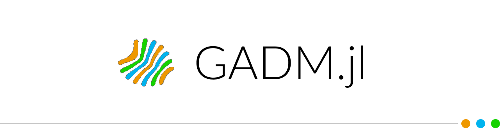

<p align="center">
  <br>
  <a href="https://github.com/JuliaGeo/GADM.jl/actions">
    
  </a>
  <a href="https://codecov.io/gh/JuliaGeo/GADM.jl">
    
  </a>
  <a href="LICENSE">
    
  </a>
</p>

This package provides polygons/multipolygons for all countries and their sub-divisions from the [GADM dataset](https://gadm.org/).
It fetches the data dynamically from the officially hosted database using [DataDeps.jl](https://github.com/oxinabox/DataDeps.jl)
and provides a minimal wrapper API to get the coordinates of the requested geometries.

## Installation

Get the latest stable release with Julia's package manager:

```julia
] add GADM
```

## Usage

`GADM.get` returns polygons/multipolygons, which implement the [GeoInterface](https://github.com/JuliaGeo/GeoInterface.jl):

```julia
import GADM

# GADM.get(<country>, <province/state>, <district>, <city>, ...)

# get boundary of the country India
india = GADM.get("IND")

# get boundary of the state/province Uttar Pradesh in  India
uttar = GADM.get("IND", "Uttar Pradesh")

# get boundary of the district Lucknow in Uttar Pradesh, India
lucknow = GADM.get("IND", "Uttar Pradesh", "Lucknow")
```

The keyword `children=true` can be used to return a table of polygons for all subregions according to
the [Tables.jl](https://github.com/JuliaData/Tables.jl) interface:

```julia
using PrettyTables

brazil, states = GADM.get("BRA", children=true)

pretty_table(states)
┌────────┬────────┬──────────┬─────────────────────┬──────────────────────┬───────────┬──────────────────┬──────────
│  GID_0 │ NAME_0 │    GID_1 │              NAME_1 │            VARNAME_1 │ NL_NAME_1 │           TYPE_1 │         ⋯
│ String │ String │   String │              String │               String │    String │           String │         ⋯
├────────┼────────┼──────────┼─────────────────────┼──────────────────────┼───────────┼──────────────────┼──────────
│    BRA │ Brazil │  BRA.1_1 │                Acre │                      │           │           Estado │         ⋯
│    BRA │ Brazil │  BRA.2_1 │             Alagoas │                      │           │           Estado │         ⋯
│    BRA │ Brazil │  BRA.3_1 │               Amapá │                      │           │           Estado │         ⋯
│    BRA │ Brazil │  BRA.4_1 │            Amazonas │              Amazone │           │           Estado │         ⋯
│    BRA │ Brazil │  BRA.5_1 │               Bahia │                 Ba¡a │           │           Estado │         ⋯
│    BRA │ Brazil │  BRA.6_1 │               Ceará │                      │           │           Estado │         ⋯
│    BRA │ Brazil │  BRA.7_1 │    Distrito Federal │                      │           │ Distrito Federal │ Federal ⋯
│    BRA │ Brazil │  BRA.8_1 │      Espírito Santo │       Espiritu Santo │           │           Estado │         ⋯
│    BRA │ Brazil │  BRA.9_1 │               Goiás │          Goiáz|Goyáz │           │           Estado │         ⋯
│    BRA │ Brazil │ BRA.10_1 │            Maranhão │ São Luíz de Maranhão │           │           Estado │         ⋯
│    BRA │ Brazil │ BRA.12_1 │         Mato Grosso │         Matto Grosso │           │           Estado │         ⋯
│    BRA │ Brazil │ BRA.11_1 │  Mato Grosso do Sul │                      │           │           Estado │         ⋯
│    BRA │ Brazil │ BRA.13_1 │        Minas Gerais │   Minas|Minas Geraes │           │           Estado │         ⋯
│    BRA │ Brazil │ BRA.14_1 │                Pará │                      │           │           Estado │         ⋯
│    BRA │ Brazil │ BRA.15_1 │             Paraíba │             Parahyba │           │           Estado │         ⋯
│    BRA │ Brazil │ BRA.16_1 │              Paraná │                      │           │           Estado │         ⋯
│    BRA │ Brazil │ BRA.17_1 │          Pernambuco │           Pernambouc │           │           Estado │         ⋯
│    BRA │ Brazil │ BRA.18_1 │               Piauí │               Piauhy │           │           Estado │         ⋯
│    BRA │ Brazil │ BRA.19_1 │      Rio de Janeiro │                      │           │           Estado │         ⋯
│    BRA │ Brazil │ BRA.20_1 │ Rio Grande do Norte │                      │           │           Estado │         ⋯
│    BRA │ Brazil │ BRA.21_1 │   Rio Grande do Sul │                      │           │           Estado │         ⋯
│    BRA │ Brazil │ BRA.22_1 │            Rondônia │              Guaporé │           │           Estado │         ⋯
│    BRA │ Brazil │ BRA.23_1 │             Roraima │           Rio Branco │           │           Estado │         ⋯
│    BRA │ Brazil │ BRA.24_1 │      Santa Catarina │      Santa Catharina │           │           Estado │         ⋯
│    BRA │ Brazil │ BRA.25_1 │           São Paulo │                      │           │           Estado │         ⋯
│    BRA │ Brazil │ BRA.26_1 │             Sergipe │                      │           │           Estado │         ⋯
│    BRA │ Brazil │ BRA.27_1 │           Tocantins │                      │           │           Estado │         ⋯
└────────┴────────┴──────────┴─────────────────────┴──────────────────────┴───────────┴──────────────────┴──────────
                                                                                                   4 columns omitted
```

- **Country Code** follows the ISO 3166 Alpha 3 standard, you can find the code for your country [here](https://en.wikipedia.org/wiki/ISO_3166-1_alpha-3).  
- Other regions require "approximately" official names that are at least contained (case-insensitive) in the official name.

The coordinate reference system is longitude/latitude and the WGS84 datum.

## Credits

GADM, the Database of Global Administrative Areas, is a high-resolution database of country administrative areas, with a goal of "all countries, at all levels, at any time period." The database is available in a few export formats, including shapefiles that are used in most common GIS applications.

Please read their license at https://gadm.org/license.html which is different than the MIT license of the GADM.jl package.
